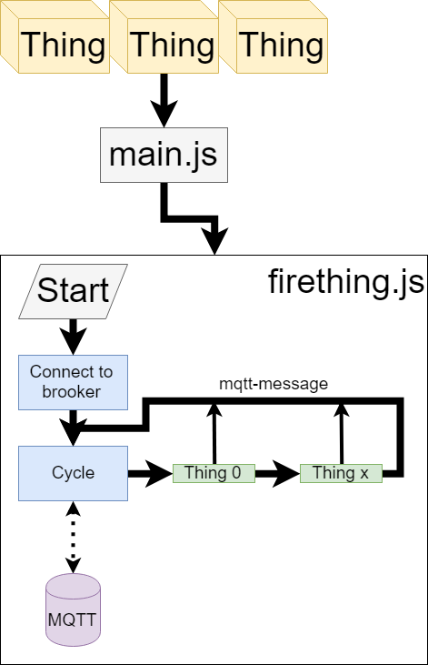

# FireThing IoT
My library to wrap MQTT communication for IoT.
## Install
1. prepare enviroment
	1. install nodejs
2. clone repo
3. open terminal, navigate to folder
4. run command `npm install` 
5. edit `main.js` (edit your default values, and mqtt server)


## Overview
FireThingJs is library to easy create IoT with mqtt support. 
* it support send message to MQTT 
* it support receive MQTT command to run IoT rutine so you can control IoT by MQTT message

## Life cycle
[](LiveCycle.png)


## Troubleshoot
### Cannot find module 'xxxx'
```
node main.js
module.js:557
    throw err;
    ^

Error: Cannot find module 'mqtt'
    at Function.Module._resolveFilename (module.js:555:15)
```

You need install all `NPM` packages, open your favorite terminal application, navigate to repo folder and run command.
`npm install` - this will download all necesary packages.